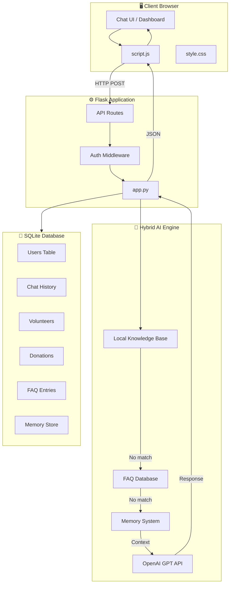
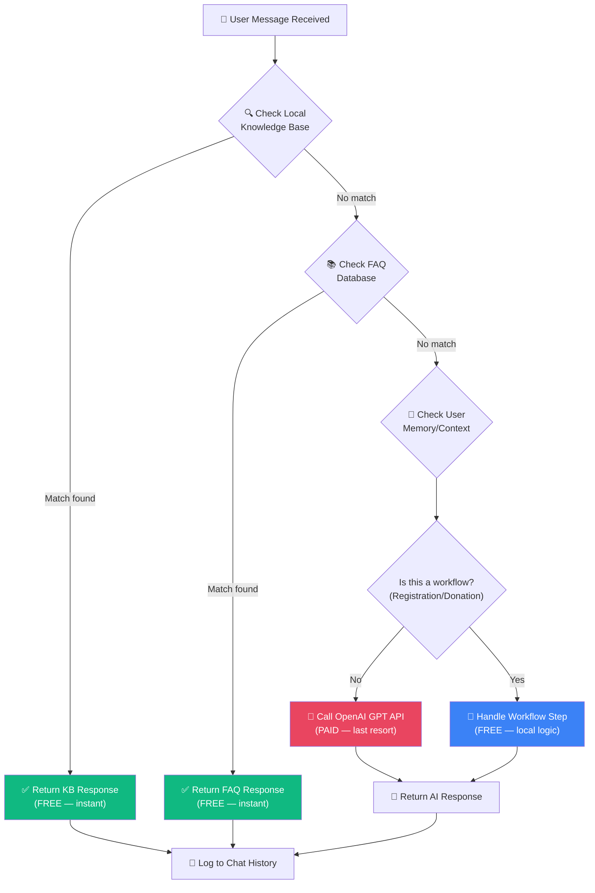
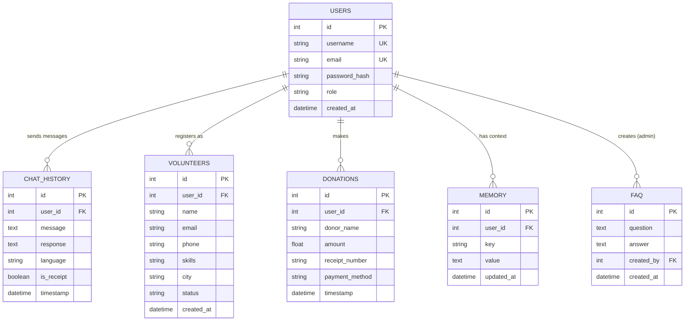
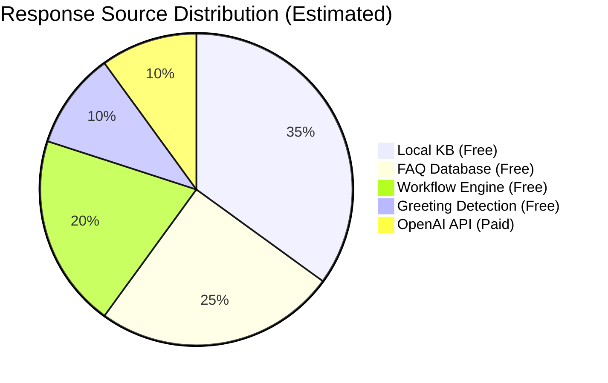
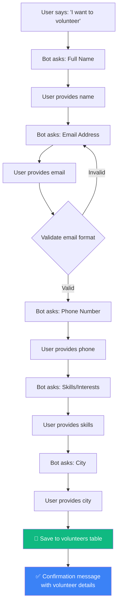
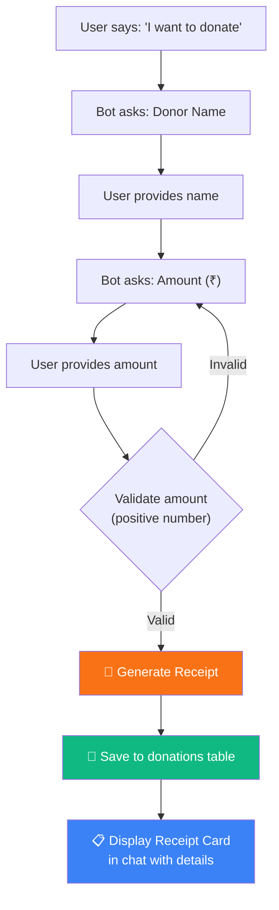

# 🧡 NayePankh AI Smart Assistant Platform

> **An AI-powered conversational assistant built for NayePankh Foundation** — streamlining volunteer registration, donation management, and community engagement through an intelligent, multi-language chatbot with a beautiful admin dashboard.

---

## 🌟 Overview

The **NayePankh AI Smart Assistant** is a full-stack web application designed to help NayePankh Foundation automate and enhance its core operations. Built on a **Hybrid AI Architecture**, it combines a curated local knowledge base, FAQ database, and OpenAI GPT integration to deliver fast, accurate, and cost-effective responses to volunteers, donors, and community members.

The platform features a stunning, responsive UI with glassmorphism design, dark/light mode support, and real-time analytics — all built to impress stakeholders and donors.

---

## 🚀 Features

| Feature | Description |
|---------|-------------|
| 🤖 **AI Chatbot** | Hybrid architecture — local KB → FAQ DB → OpenAI fallback |
| 📝 **Volunteer Registration** | Guided conversational flow with data validation |
| 💰 **Donation Management** | Amount processing with auto-generated receipts |
| 📊 **Admin Dashboard** | Real-time analytics, charts, and user management |
| 🎙️ **Voice Input** | Speech-to-text via Web Speech API |
| 🌗 **Dark/Light Mode** | User preference persisted in localStorage |
| 🌐 **Multi-language** | English, Hindi, Tamil, Telugu, Kannada |
| 🧠 **Memory System** | Contextual memory — remembers user details |
| 📚 **FAQ Management** | Admin-curated Q&A to reduce API costs |
| 📱 **Responsive Design** | Mobile-first, works beautifully on all devices |
| 🔔 **Toast Notifications** | Non-intrusive feedback for all user actions |
| ✅ **Form Validation** | Client-side validation with inline error messages |

---

## 🏗️ Architecture

### High-Level System Architecture



### Hybrid AI Decision Flow



---

## 📁 Project Structure

```
NayePankh Foundation/
├── app.py                  # Main Flask application (routes, AI logic, DB)
├── requirements.txt        # Python dependencies
├── README.md               # This documentation file
├── nayepankh.db            # SQLite database (auto-created on first run)
│
├── static/
│   ├── style.css           # Premium stylesheet (600+ lines)
│   └── script.js           # Complete client-side JavaScript (400+ lines)
│
└── templates/
    ├── login.html           # Authentication — login page
    ├── register.html        # Authentication — registration page
    ├── chat.html            # Main chat interface
    └── dashboard.html       # Admin analytics dashboard
```

---

## 🛠️ Installation

### Prerequisites

- **Python 3.8+** (3.10+ recommended)
- **pip** (Python package manager)
- A modern web browser (Chrome, Firefox, Edge, Safari)

### Steps

```bash
# 1. Navigate to the project directory
cd "D:\NayePankh Foundation"

# 2. (Recommended) Create a virtual environment
python -m venv venv
venv\Scripts\activate          # Windows
# source venv/bin/activate     # macOS / Linux

# 3. Install dependencies
pip install -r requirements.txt

# 4. (Optional) Set your OpenAI API key for full AI capabilities
set OPENAI_API_KEY=sk-your-api-key-here          # Windows CMD
# $env:OPENAI_API_KEY="sk-your-api-key-here"     # PowerShell
# export OPENAI_API_KEY=sk-your-api-key-here      # macOS / Linux

# 5. Run the application
python app.py

# 6. Open in your browser
# → http://localhost:5000
```

> [!TIP]
> The chatbot works **without an OpenAI key** — it falls back to the local knowledge base and FAQ database. The API key only adds GPT-powered responses for unrecognized queries.

### Default Admin Account

| Field    | Value      |
|----------|------------|
| Username | `admin`    |
| Password | `admin123` |

> [!WARNING]
> Change the default admin password immediately after first login in a production environment.

---

## 📊 Database Schema

The application uses **SQLite** for zero-configuration storage. The database file (`nayepankh.db`) is created automatically on first run.

### Tables Overview

| Table | Purpose | Key Columns |
|-------|---------|-------------|
| `users` | Authentication & user management | id, username, email, password_hash, role, created_at |
| `chat_history` | Conversation logs | id, user_id, message, response, language, timestamp |
| `volunteers` | Registered volunteer records | id, user_id, name, email, phone, skills, city, status |
| `donations` | Donation transactions | id, user_id, donor_name, amount, receipt_number, timestamp |
| `faq` | Admin-curated Q&A pairs | id, question, answer, created_by, created_at |
| `memory` | User context/preferences | id, user_id, key, value, updated_at |

### Entity Relationship Diagram



---

## 🤖 Hybrid AI Architecture — Deep Dive

The chatbot uses a **6-step processing pipeline** designed to minimize API costs while maximizing response quality:

### Processing Pipeline

| Step | Source | Cost | Latency | Description |
|------|--------|------|---------|-------------|
| 1 | **Greeting Detection** | Free | ~1ms | Pattern-match greetings (hi, hello, namaste…) |
| 2 | **Local Knowledge Base** | Free | ~2ms | Keyword search in hardcoded NGO knowledge |
| 3 | **FAQ Database** | Free | ~5ms | Fuzzy match against admin-curated Q&A pairs |
| 4 | **Workflow Engine** | Free | ~3ms | Handle multi-step volunteer/donation flows |
| 5 | **Memory Context** | Free | ~2ms | Retrieve user preferences and history |
| 6 | **OpenAI GPT API** | Paid | ~1-3s | Last resort for complex/unknown queries |

### Cost Savings Analysis



> [!IMPORTANT]
> By handling ~90% of queries locally, the platform can serve thousands of users while keeping API costs under **$5/month** for typical NGO usage.

---

## 🔄 Workflows

### Volunteer Registration Flow

A guided, conversational multi-step process:



### Donation Processing Flow



---

## 🌐 Multi-language Support

### Currently Supported Languages

| Code | Language | Speech Recognition |
|------|----------|--------------------|
| `en` | English  | ✅ `en-US` |
| `hi` | Hindi    | ✅ `hi-IN` |
| `ta` | Tamil    | ✅ `ta-IN` |
| `te` | Telugu   | ✅ `te-IN` |
| `kn` | Kannada  | ✅ `kn-IN` |

### Adding a New Language

1. Add the language option to the `<select id="language-selector">` in `chat.html`
2. Add the speech recognition locale mapping in `script.js` → `initVoice()` → `langMap`
3. Add translated greeting patterns and KB entries in `app.py`
4. (Optional) Configure OpenAI system prompt to respond in the target language

---

## 🔒 Security

| Measure | Implementation |
|---------|----------------|
| **Password Hashing** | Werkzeug's `generate_password_hash` (PBKDF2-SHA256) |
| **Session Management** | Flask-Login with secure session cookies |
| **CSRF Protection** | Flask form tokens |
| **Input Sanitization** | Server-side validation on all user inputs |
| **SQL Injection Prevention** | Parameterized queries throughout |
| **Role-based Access** | Admin vs. regular user roles |
| **XSS Prevention** | Content escaping in templates (Jinja2 auto-escape) |

> [!CAUTION]
> For production deployment, ensure you:
> - Set a strong `SECRET_KEY` in `app.py`
> - Use HTTPS (SSL/TLS)
> - Change the default admin credentials
> - Set `SESSION_COOKIE_SECURE = True`

---

## 🚀 Future Enhancements

- [ ] 📱 **WhatsApp Business API** — Extend the chatbot to WhatsApp
- [ ] 📧 **Email Notifications** — SendGrid/SMTP for volunteer confirmations & donation receipts
- [ ] 🔊 **Voice Output** — Text-to-speech for accessibility
- [ ] ☁️ **Cloud Deployment** — Docker + AWS/GCP/Azure hosting
- [ ] 🤝 **AI Volunteer Matching** — Match volunteers to events based on skills & location
- [ ] ⛓️ **Blockchain Receipts** — Tamper-proof donation tracking
- [ ] 📲 **Mobile App** — React Native or Flutter companion app
- [ ] 📈 **Advanced Analytics** — Cohort analysis, retention metrics, AI-powered insights
- [ ] 🔗 **CRM Integration** — Sync with Salesforce/HubSpot for donor management
- [ ] 🧪 **A/B Testing** — Test different chatbot responses for engagement optimization

---

## 📄 License

This project is licensed under the **MIT License**.

```
MIT License

Copyright (c) 2024 NayePankh Foundation

Permission is hereby granted, free of charge, to any person obtaining a copy
of this software and associated documentation files (the "Software"), to deal
in the Software without restriction, including without limitation the rights
to use, copy, modify, merge, publish, distribute, sublicense, and/or sell
copies of the Software, and to permit persons to whom the Software is
furnished to do so, subject to the following conditions:

The above copyright notice and this permission notice shall be included in all
copies or substantial portions of the Software.

THE SOFTWARE IS PROVIDED "AS IS", WITHOUT WARRANTY OF ANY KIND, EXPRESS OR
IMPLIED, INCLUDING BUT NOT LIMITED TO THE WARRANTIES OF MERCHANTABILITY,
FITNESS FOR A PARTICULAR PURPOSE AND NONINFRINGEMENT.
```

---

## 🤝 Contributing

We welcome contributions from the community! Here's how you can help:

1. **Fork** the repository
2. **Create** a feature branch: `git checkout -b feature/amazing-feature`
3. **Commit** your changes: `git commit -m 'Add amazing feature'`
4. **Push** to the branch: `git push origin feature/amazing-feature`
5. **Open** a Pull Request

### Contribution Guidelines

- Follow existing code style and conventions
- Write descriptive commit messages
- Add comments for complex logic
- Test your changes before submitting
- Update documentation as needed

---

## 📞 Contact

**NayePankh Foundation**

| Channel | Details |
|---------|---------|
| 🌐 Website | [www.nayepankh.com](https://www.nayepankh.com) |
| 📧 Email | [info@nayepankh.com](mailto:info@nayepankh.com) |
| 💬 Platform | [localhost:5000](http://localhost:5000) (local dev) |

---

<p align="center">
  Made with 🧡 by <strong>NayePankh Foundation</strong><br>
  <em>Empowering communities through technology</em>
</p>
